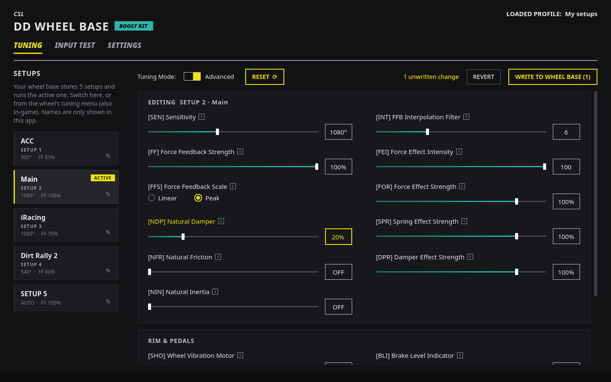
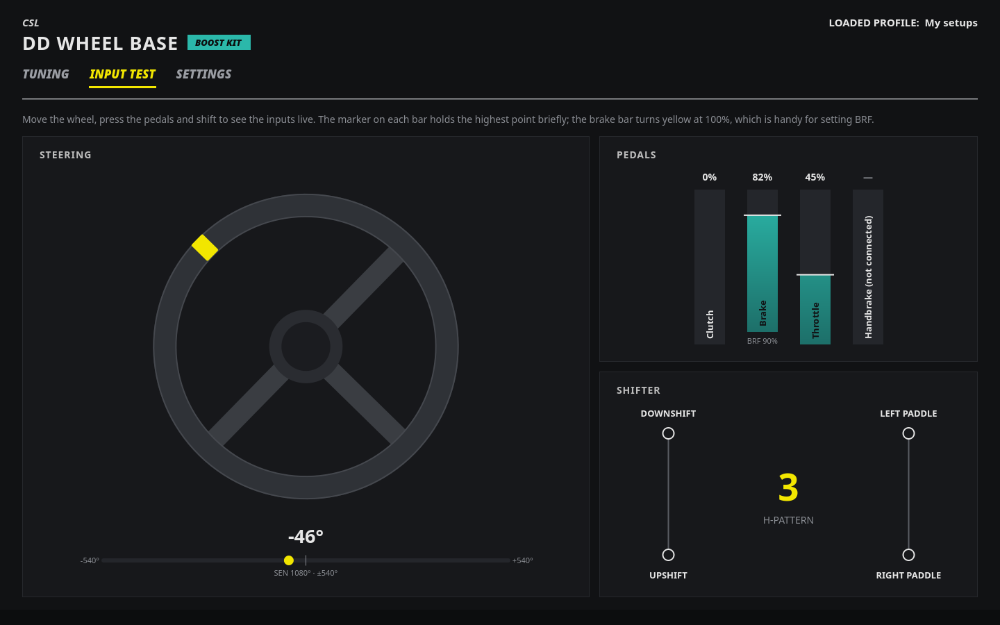
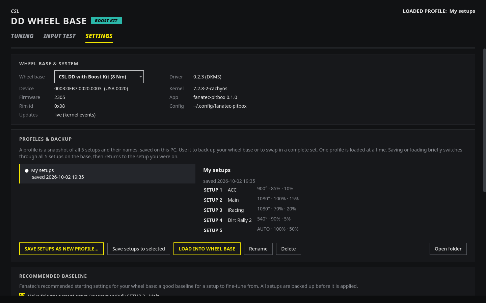

# Fanatec Pitbox

A small Linux desktop app for tuning Fanatec wheel bases: the tuning menu, the base's 5 setups, a live input
test, and backups of your setups. It is a graphical helper on top of the
**[hid-fanatecff](https://github.com/gotzl/hid-fanatecff)** kernel driver.



| Input test | Settings, profiles & backup |
|---|---|
|  |  |

## Credit where it's due

All the hard work is done by **[hid-fanatecff](https://github.com/gotzl/hid-fanatecff)** by
[gotzl](https://github.com/gotzl) and its contributors: the driver that makes Fanatec wheel bases, force
feedback and the tuning menu work on Linux at all. Fanatec Pitbox only reads and writes what that driver
exposes, so you can tune your base with sliders instead of editing sysfs files. If this app is useful to you,
please consider supporting and starring the driver project.

The recommended baseline comes from Fanatec's own
[Recommended Settings](https://forum.fanatec.com/topic/541-iracing-pc-fanatec-recommended-settings/) post on the
Fanatec Community forum (its values are close to Fanatec's recommendations for other sims too); the app links to it as
the source.

## Why this exists

I built this for my own sim racing setup on Linux, because tuning the base meant writing values into sysfs files
one by one. It was created together with [Claude](https://claude.com/claude-code) (Anthropic's AI coding
assistant), out of personal need. I'm sharing it in case others find it helpful, or want to build on it. It is
not affiliated with or endorsed by Fanatec / Endor AG.

## Features

- **Tuning.** All tuning menu settings of your base (SEN, FF, FFS, NDP, NFR, NIN, INT, FEI, FOR, SPR, DPR, SHO,
  BLI, BRF, …), laid out like Fanatec's own app, with a short explanation of each setting on hover.
  Nothing is written until you click *Write to wheel base*; unwritten changes are highlighted and can be reverted.
- **Setups.** The base stores 5 setups and runs the active one. Switch between them in the app (or on the wheel;
  the app follows) and give them names such as the game they are for.
- **Input test.** Live view of steering (angle and position within your SEN range), clutch, brake, throttle and
  handbrake, plus shifter and paddle inputs. The brake bar turns yellow at 100%, which makes setting BRF easy.
- **Profiles & backup.** Save all 5 setups (and their names) as a profile and load them back. The current setups
  are backed up automatically before a profile is loaded or the tuning mode is changed.
- **Recommended baseline.** Never tuned your wheel base? On first start the app asks which wheel base you have and
  offers to start from Fanatec's recommended baseline, with your current values shown next to the recommended ones
  so you can see what changes. It's written to your current setup after a backup, or you keep your settings as they
  are. Available any time under *Settings → Recommended baseline*.
- **Standard / Advanced mode** mirrors the base's own tuning menu.

## Requirements

- Linux with the [hid-fanatecff](https://github.com/gotzl/hid-fanatecff) driver installed and working
  (on Arch/CachyOS: the AUR package `hid-fanatecff-dkms`).
- Your user in the `games` group, which the driver's udev rule gives write access to the tuning settings:
  `sudo usermod -aG games $USER`, then log out and in again (on KDE Plasma a reboot may be needed).
- Python 3.11+ and PySide6 (Arch/CachyOS: `sudo pacman -S pyside6`).
- Recommended: `evdev-joystick` (Arch: `joyutils`), so the driver's udev rule can remove the axis deadzone.

## Install and run

```
git clone https://github.com/chornyak/fanatec-pitbox.git
cd fanatec-pitbox
./fanatec-pitbox          # start the app
./install-desktop.sh      # optional: add "Fanatec Pitbox" to your application launcher
```

## Tested hardware

- CSL DD wheel base (driver 0.2.3), ClubSport Pedals V3 and ClubSport Shifter SQ connected to the base.

Other bases supported by the driver should work for tuning, since the app only shows the settings the driver
exposes for your base. The input test's mapping was captured on the hardware above; other pedals, handbrakes or
bases may report their inputs differently. Reports and contributions are welcome.

## Notes on the driver (hid-fanatecff 0.2.3)

Two things found while building this, which may help others (and may be fixed in the driver in future):

- **Brake force (BRF).** The driver's `brF` file writes tuning address 0x10, which the base stores but does not
  apply. The brake force the base actually uses, and that Fanatec's own app sets, is at address 0x0f. Fanatec
  Pitbox reads and writes it through the driver's hidraw device. This was found with a USB capture of the
  official app (`references/BRF_log.pcapng`).
- **After a reboot**, if the base stayed powered on, the driver has no tuning data until the base reports it,
  and every value reads 0. The base only reports when something changes, so the app briefly selects another
  setup and switches back (Advanced mode only).
- On the CSL DD, switching the base to Standard mode and back can overwrite the active setup. The app asks first
  and backs up all setups before changing the mode.

## Configuration

Setup names, the last-seen values of each setup and profiles are stored in `~/.config/fanatec-pitbox/`.
Profiles are small TOML files, one per profile.

## Development

```
QT_QPA_PLATFORM=offscreen python -m unittest discover tests   # runs against a fake wheel base, no hardware needed
FANATEC_PITBOX_SYSFS=/path/to/fake FANATEC_PITBOX_CONFIG=/tmp/cfg python -m fanatec_pitbox
python tools/probe_inputs.py                                  # step-by-step check of which input is which
```

## License

GPL-2.0, the same licence as the [hid-fanatecff](https://github.com/gotzl/hid-fanatecff) driver; see
[LICENSE](LICENSE). Forks and improvements are very welcome.
